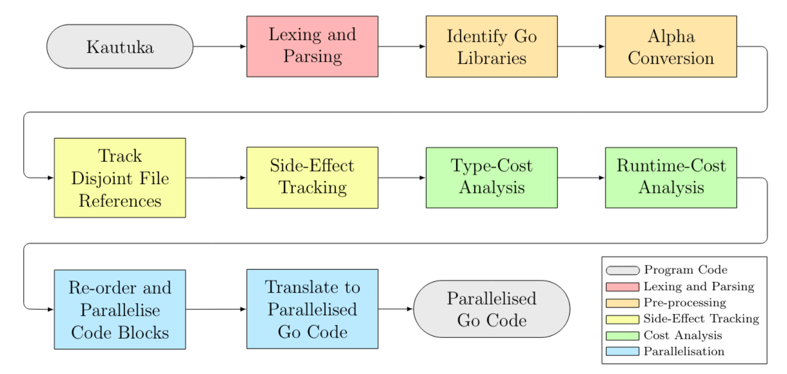

# Automatic Parallelisation using Effect Tracking and Cost Analysis

An OCaml transpiler which compiles sequential Go code into multithreaded Go code.

Accompanying Thesis: [https://github.com/DylanMoss1/Bachelors-Thesis](https://github.com/DylanMoss1/Bachelors-Thesis).

### Problem Statement

Turning sequential code into parallel code can improve program performance – but programmers often face two major problems: 
- You must ensure that threads do not interfere (especially if they share state).
- It is not always obvious if parallelisation leads to performance improvements for non-trivial examples.

### Solution

This project solves these problems with two steps of static analysis: 
- **Preventing thread interference:** We can track program side effects (such as variable mutations, file writes, etc.) using an effects systems (an extension of a classic type system). We can prove that threads do not interfere by statically verifying that they do not contain conflicting side effects.

- **Statically estimate performance improvements:** We also extend classic type systems with cost analysis: static analysis which estimates the size, and hence run-time performance, of data type instances. This allows us to predict how long programs will run for, and hence determine if there is any benefit in parallelising adjacent blocks of code. We require minor annotations from programmers in order to estimate data-type sizes that cannot be inferred (such as the upper bounds of user inputs).

If sequential blocks of code meet both of these requirements, we can **automatically parallelise** these blocks when compiling the program. Our analysis provides us static guarantees that this operation is safe, and strong evidence that code performance will improve.

### Results

This technique improved runtime performance by an average of 35% on our benchmarks.

This dissertation achieved 90% for my BA Computer Science dissertation at the University of Cambridge, awarding me the CST Department Prize "Highly Commended Dissertation".
